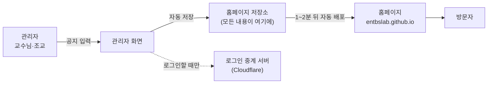
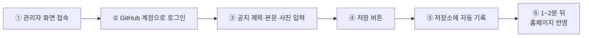
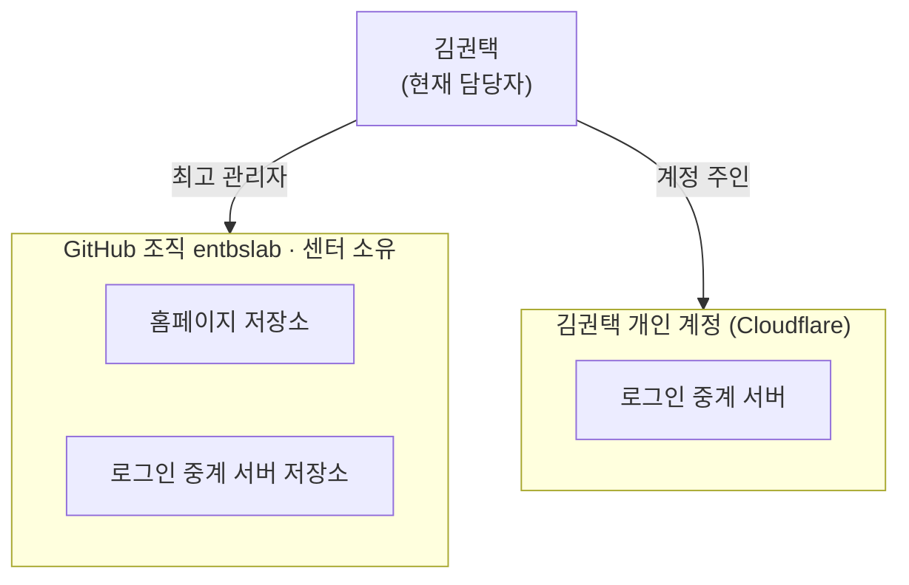
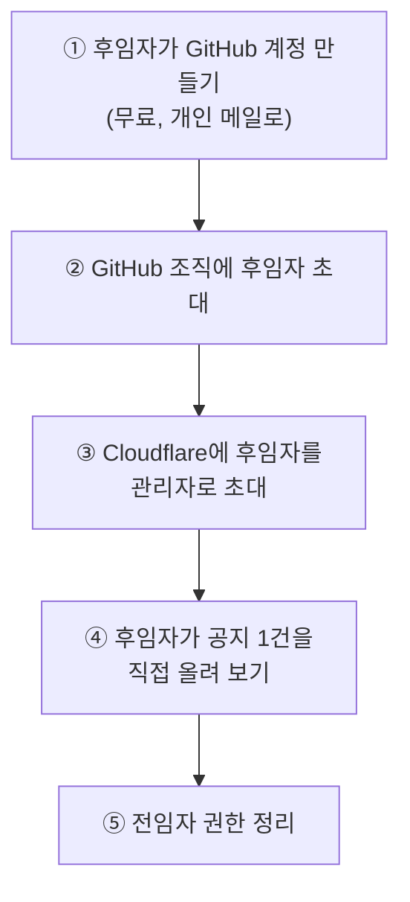

# 엔터테인먼트경영연구센터 홈페이지 구조·관리·인수인계

기준일: 2026-09-28 · 공유용 문서: https://claude.ai/code/artifact/a845759f-c594-4069-b765-e111d6216098

홈페이지는 서버나 유료 서비스 없이, 무료 인터넷 서비스 두 곳(GitHub, Cloudflare)에서 돌아갑니다. 담당자가 바뀔 때는 이 두 곳의 관리 권한만 넘겨주면 됩니다.

- 홈페이지 주소: https://entbslab.github.io/
- 메뉴: HOME · ABOUT · PEOPLE · PERFORMANCE · NOTICE · CONTACT
- 관리자 화면 주소: https://entbslab.github.io/admin/
- 현재 담당자: 김권택

## 1. 홈페이지는 무엇으로 이뤄져 있나

홈페이지의 모든 내용은 "홈페이지 저장소" 한 곳에 들어 있고, 나머지는 그걸 보여주거나 고치게 도와주는 역할입니다.

| 구성 | 하는 일 | 어디에 있나 |
| --- | --- | --- |
| 홈페이지 저장소 | 페이지, 공지, 연구진, 사진 등 홈페이지의 모든 내용과 수정 기록 | GitHub, GitHub 조직 안 |
| 관리자 화면 | 공지·연구진·사진을 입력하는 화면 | 홈페이지 주소 뒤에 /admin/ |
| 자동 배포 | 저장소가 바뀌면 홈페이지를 새로 만들어 올림 | GitHub, 자동으로 동작 |
| 호스팅 | 홈페이지를 인터넷에 공개 | GitHub, 무료 |
| 로그인 중계 서버 | 관리자 화면 로그인을 연결 | Cloudflare, 김권택 개인 계정 안 |
| 로그인 중계 서버 저장소 | 로그인 중계 서버의 원본. 손댈 일 없음 | GitHub, GitHub 조직 안 |

구글 지도, 글꼴 등 외부에서 가져오는 것도 있지만 모두 무료이고 계정이 필요 없습니다.

## 2. 공지는 어떻게 올라가나

관리자가 저장 버튼만 누르면 나머지는 자동이고, 1~2분 뒤 홈페이지에 나타납니다.

- ①~④가 사람이 하는 일이고, ⑤~⑥은 저절로 됩니다.
- 로그인은 각자 자기 GitHub 계정으로 합니다. GitHub 조직에 초대받은 사람만 저장할 수 있고, 따로 공유하는 아이디·비밀번호는 없습니다.
- 모든 수정이 기록으로 남아, 잘못 고친 것도 이전 상태로 되돌릴 수 있습니다.

**관리자 화면에서 바꿀 수 있는 것**

| 메뉴 | 내용 |
| --- | --- |
| 공지사항, 공지사항 · 자료실 | 추가·수정·삭제, 사진·첨부파일 |
| 연구진 | 이름, 소속, 사진, 표시 순서 |
| 성과 · 연구 프로젝트, 논문·출판, 세미나·포럼, 센터 소식 | 추가·수정·삭제. 홈페이지 PERFORMANCE 한 페이지에 모여 나옴 |
| 소개 · 설정 | 센터 소개문, 센터장 인사말, 연락처, 지도, 메뉴 이름, 로고, 배너 사진 |

페이지를 새로 만들거나 디자인·배치를 바꾸는 일은 관리자 화면으로는 못 하고, 코딩이 가능한 사람이 해야 합니다.

## 3. 누구 명의로 되어 있나

홈페이지 본체는 GitHub 조직에 있고, 로그인 중계 서버(Cloudflare)만 김권택 개인 계정에 있습니다. 현재는 모두 김권택이 관리하고 있습니다.

관리자는 각 서비스에서 구성원을 초대하는 방식으로 추가합니다. 관리자를 2명 이상 두면 담당자가 바뀌어도 관리가 끊기지 않습니다.

| 항목 | 명의 | 현재 관리자 | 비용 | 비고 |
| --- | --- | --- | --- | --- |
| GitHub 조직 entbslab | 센터 | 김권택 (최고 관리자) | 무료 | 최고 관리자는 2명 이상 두는 것이 안전 |
| 홈페이지 저장소 | GitHub 조직 | 조직 구성원 | 무료 | 공개 상태여야 무료로 홈페이지가 열림 |
| 로그인 중계 서버 저장소 | GitHub 조직 | 김권택 | 무료 | 손댈 일 없음 |
| OAuth 앱 | GitHub 조직 | 김권택 | 무료 | |
| 로그인 중계 서버 (Cloudflare) | 김권택 개인 | 김권택 | 무료 | **개인 계정. 인수인계 시 이전 대상** |

참고로 김권택의 GitHub 아이디는 screamingpeanut01입니다. 다른 조교를 추가할 때는 그 사람의 GitHub 아이디를 받아 GitHub 조직에 초대하면 됩니다.

## 4. 평소에 무엇을 관리해야 하나

평소에는 조교가 관리자 화면에서 공지를 올리는 것이 전부이고, 1년에 한 번 30분 정도 점검하면 됩니다. 프로그램 업데이트나 서버 관리는 필요 없습니다.

| 언제 | 무엇을 | 누가 |
| --- | --- | --- |
| 수시 | 공지·소식·자료 올리기, 연구진·논문 갱신 (건당 2분) | 조교 |
| 수시 | 소개문·인사말·연락처·사진 변경 | 조교 |
| 사람이 바뀔 때 | 새 조교를 GitHub 조직에 초대, 나간 사람 제거 | 최고 관리자 |
| 필요할 때 | 새 메뉴·페이지 추가, 디자인 변경 | 코딩 가능한 사람 |
| 1년에 한 번 | 졸업한 조교 제거, 최고 관리자가 2명 이상인지 확인 | 담당자 |
| 1년에 한 번 | 홈페이지 파일 전체를 내려받아 센터 드라이브에 백업 | 담당자 |

**문제가 생겼을 때**

| 증상 | 의미 | 해결 |
| --- | --- | --- |
| 저장했는데 홈페이지에 안 나옴 | 방금 저장한 내용에 문제가 있음 | 직전 수정을 되돌리기 (수정 기록에서 클릭 몇 번) |
| 홈페이지 위에 "데이터를 불러오지 못했습니다" | 최근 바꾼 내용이 깨짐 | 직전 수정을 되돌리기 |
| "GitHub로 로그인"이 안 됨 | 로그인 중계 서버(Cloudflare) 문제 | 담당자가 Cloudflare 확인. 급하면 다른 로그인 방법(개인 인증키)으로 대신 |
| 로그인은 되는데 저장이 안 됨 | 그 사람이 GitHub 조직에 초대되지 않았음 | 최고 관리자가 초대 |

어떤 문제가 생겨도 방문자가 보는 홈페이지는 마지막으로 잘 되던 상태로 계속 열려 있습니다. 담당자용 상세 절차는 [OPERATIONS.md](OPERATIONS.md), [ADMIN_SETUP.md](ADMIN_SETUP.md)에 있습니다.

## 5. 담당자가 바뀔 때 (인수인계)

홈페이지 파일은 이미 GitHub 조직에 있어서 옮길 것이 없고, GitHub 조직과 Cloudflare 두 곳의 관리 권한만 넘기면 됩니다. 하루면 충분합니다.

비밀번호를 알려주는 방식은 쓰지 않습니다. 두 서비스 모두 후임자 본인 계정을 "초대"하는 방식을 지원합니다.

**인수인계 체크리스트**

- [ ] 후임자 GitHub 계정을 GitHub 조직에 초대하고, 후임자가 수락했는지 확인
- [ ] 최고 관리자가 항상 2명 이상인지 확인 (교수님 + 담당자)
- [ ] Cloudflare에 후임자를 관리자로 초대 (또는 후임자 계정에 로그인 중계 서버를 새로 설치, 약 20분)
- [ ] 후임자가 관리자 화면에서 공지를 1건 올려 홈페이지에 나타나는지 확인
- [ ] 이 문서의 위치를 후임자에게 전달
- [ ] 전임자를 GitHub 조직과 Cloudflare에서 제거

로그인 중계 서버를 후임자 계정에 새로 설치하는 경우에만 설정 두 곳을 고치는 작업이 추가되며, 절차는 [ADMIN_SETUP.md](ADMIN_SETUP.md)에 있습니다.
