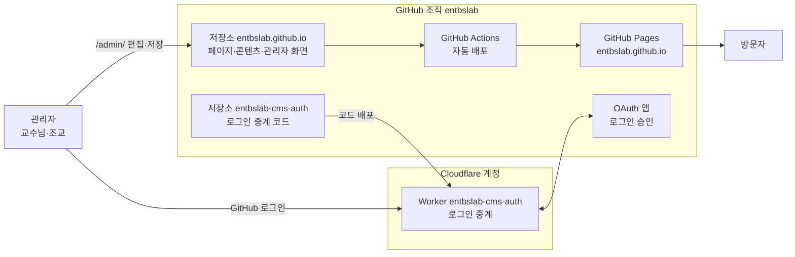
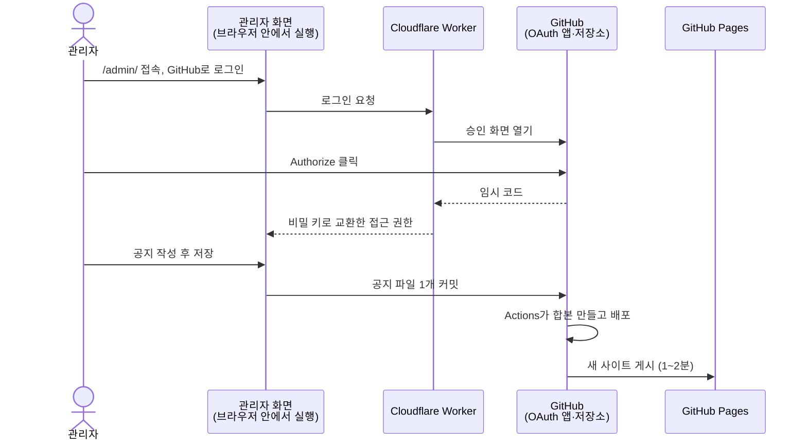
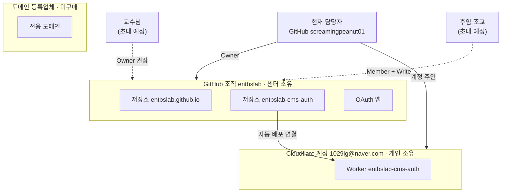
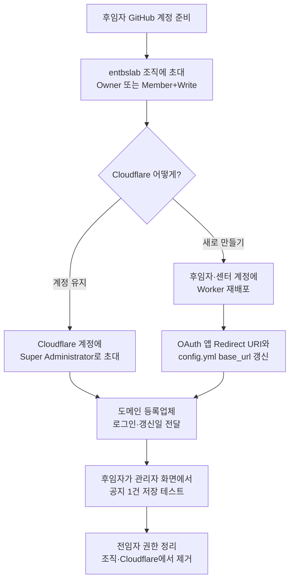

# 엔터테인먼트경영연구센터 홈페이지 구조·관리·인수인계

기준일: 2026-09-28 · 공유용 문서: https://claude.ai/code/artifact/a845759f-c594-4069-b765-e111d6216098

홈페이지는 GitHub 조직 entbslab의 공개 저장소 두 개와 Cloudflare Worker 하나로 돌아갑니다. 서버·데이터베이스·유료 결제가 없고, 인수인계는 계정 권한 3곳(GitHub 조직, Cloudflare, 도메인)만 넘기면 끝납니다.

- 사이트: https://entbslab.github.io/
- 관리자 화면: https://entbslab.github.io/admin/

## 1. 전체 구조

홈페이지 파일과 콘텐츠는 모두 GitHub 저장소 하나에 있고, Cloudflare는 관리자 로그인 중계만 맡습니다.

| 구성 요소 | 하는 일 | 주소 |
| --- | --- | --- |
| 저장소 entbslab.github.io | 페이지 6개, 공지·연구진 등 콘텐츠 파일, 관리자 화면, 배포 설정 | https://github.com/entbslab/entbslab.github.io |
| GitHub Actions | 저장소가 바뀌면 1~2분 안에 사이트를 다시 만들어 게시 | 저장소 Actions 탭 |
| GitHub Pages | 게시된 사이트를 무료로 공개, HTTPS 자동 | https://entbslab.github.io/ |
| 관리자 화면 (Sveltia CMS) | 폼으로 콘텐츠를 고치면 저장소에 대신 저장. 저장소 안의 파일 2개일 뿐 별도 서버 없음 | https://entbslab.github.io/admin/ |
| OAuth 앱 | "GitHub로 로그인" 승인 창을 띄우는 등록 정보 | entbslab 조직 Settings → Developer settings |
| 저장소 entbslab-cms-auth | 로그인 중계 프로그램의 원본 코드. 손댈 일 없음 | https://github.com/entbslab/entbslab-cms-auth |
| Cloudflare Worker | GitHub 로그인 때 비밀 키 교환만 대신하는 작은 프로그램 | https://entbslab-cms-auth.1029lg-fcb.workers.dev |

외부에서 끌어오는 것은 글꼴(Pretendard), 관리자 화면 프로그램, 구글 지도 세 가지이며 모두 계정이 필요 없습니다.

## 2. 작동 방식

관리자가 저장하면 1~2분 뒤 사이트에 반영되고, 중간에 사람이 할 일은 없습니다.

**관리자가 공지를 올릴 때**

- 로그인 이후 저장은 브라우저가 GitHub에 직접 합니다. Worker는 로그인 순간에만 쓰입니다.
- 저장소에 쓰기 권한이 있는 GitHub 계정만 저장할 수 있습니다. 별도 아이디·비밀번호는 없습니다.
- Worker가 멈춰도 "Sign In Using Access Token"(개인 토큰)으로 로그인하거나 GitHub 웹에서 파일을 직접 고칠 수 있습니다.

**방문자가 사이트를 열 때**

1. GitHub Pages가 페이지 HTML과 디자인 파일을 보냅니다.
2. 페이지가 콘텐츠 합본 파일(공지·연구진·설정 등)을 읽어 화면을 그립니다.
3. 서버·데이터베이스를 거치지 않아 Cloudflare가 멈춰도 방문자는 영향이 없습니다.

**저장소 안 파일 구조**

| 위치 | 내용 | 누가 고침 |
| --- | --- | --- |
| site/data/notices, news, members, projects, publications, seminars, resources | 항목 한 건 = 파일 하나 | 관리자 화면 |
| site/data/about.json, settings.json | 소개문·인사말, 센터명·연락처·메뉴·로고·배너·지도 | 관리자 화면 |
| site/assets/uploads | 관리자 화면에서 올린 사진·PDF | 관리자 화면 |
| site/*.html, site/assets/style.css, main.js | 페이지 구조·디자인 | 개발 가능자 |
| site/admin/config.yml | 관리자 화면의 항목·필드·로그인 주소 | 개발 가능자 |
| .github/workflows, scripts | 자동 배포와 합본 생성 | 손댈 일 없음 |
| docs | 운영 문서와 이 문서 | 담당자 |

## 3. 계정·소유 관계

홈페이지 본체는 센터 조직이 소유하지만, Cloudflare는 현재 담당자 개인 메일 계정에 있습니다.

| 자원 | 소유 계정 | 현재 권한자 | 비용 | 비고 |
| --- | --- | --- | --- | --- |
| GitHub 조직 entbslab | 조직 (무료 플랜) | screamingpeanut01 (생성자, Owner) | 0원 | 교수님을 Owner로 추가해야 함 |
| 저장소 entbslab.github.io | entbslab 조직 | 조직 Owner·Write 멤버 | 0원 | 공개 저장소여야 Pages 무료 |
| 저장소 entbslab-cms-auth | entbslab 조직 | 조직 Owner | 0원 | Cloudflare가 복사해 만든 저장소. 손댈 일 없음 |
| GitHub Pages | 저장소 entbslab.github.io | 저장소 Admin | 0원 | 배포 브랜치 gh-pages |
| OAuth 앱 | entbslab 조직 | 조직 Owner | 0원 | Client Secret은 Cloudflare에만 저장됨 |
| Cloudflare Worker | Cloudflare 계정 1029lg@naver.com | 현재 담당자 개인 | 0원 (무료 구간) | **개인 메일 계정. 인수인계 대상** |
| 전용 도메인 | 미구매 | - | 연 1.5만~3만원 | 센터 명의·운영비 결제 권장 |
| 옛 개인 저장소 screamingpeanut01/ku_entbs_page | 개인 | 현재 담당자 | 0원 | 더 이상 쓰지 않음. Archive 또는 삭제 |

관리자 화면 로그인은 각자 개인 GitHub 계정으로 합니다. 조직에서 빼면 접근이 바로 끊기므로 비밀번호를 바꿀 일이 없습니다.

## 4. 관리에 필요한 일

일상 업무는 관리자 화면에서 건당 2분이고, 정기 점검은 연 1회 30분입니다. 업데이트할 서버·플러그인은 없습니다.

| 주기 | 일 | 누가 | 어디서 |
| --- | --- | --- | --- |
| 수시 | 공지·소식·자료 추가, 수정, 삭제 | 조교 | 관리자 화면 해당 메뉴 |
| 수시 | 연구진·논문·프로젝트·세미나 갱신 | 조교 | 관리자 화면 |
| 수시 | 소개문·인사말·연락처·메뉴·로고·배너·지도 변경 | 조교 | 관리자 화면 → 소개·설정 |
| 수시 | 관리자 추가·제거 | 조직 Owner | GitHub 조직 Settings → People |
| 필요 시 | 디자인·페이지 구조 변경, 새 메뉴 | 개발 가능자 | 저장소 코드 수정 |
| 연 1회 | 도메인 만료일·자동 갱신 확인 | 담당자 | 도메인 등록업체 |
| 연 1회 | 조직 멤버 정리 (졸업자 제거), Owner 2명 이상 확인 | 담당자 | GitHub 조직 People |
| 연 1회 | 백업: 저장소 Code → Download ZIP, 센터 드라이브 보관 | 담당자 | GitHub 저장소 |
| 연 1회 | 개인 토큰을 쓰는 사람은 만료 전 재발급 | 해당자 | GitHub 개인 Settings |

**장애 시 확인 순서**

1. 저장 후 반영이 안 됨 → 저장소 Actions 탭에서 빨간 X 확인 → 해당 커밋을 Revert
2. 사이트 상단에 "데이터를 불러오지 못했습니다" → 최근 수정한 데이터 파일 문제. 최근 커밋 Revert
3. "Sign In with GitHub"가 안 됨 → Cloudflare Worker 상태와 변수 3개 확인. 급하면 토큰 로그인으로 대체
4. 로그인은 되는데 저장 안 됨 → 그 계정의 저장소 쓰기 권한, 조직의 외부 앱 접근 허용 확인

자세한 절차는 [OPERATIONS.md](OPERATIONS.md)(운영), [ADMIN_SETUP.md](ADMIN_SETUP.md)(관리자 화면·로그인)에 있습니다.

## 5. 인수인계 절차

넘길 것은 권한 세 가지(GitHub 조직, Cloudflare, 도메인)이고, 코드·콘텐츠는 조직 저장소에 이미 있어 옮길 것이 없습니다. 하루 안에 끝납니다.

Cloudflare는 두 가지 중 하나를 고릅니다. 계정을 유지하면 주소가 그대로라 설정을 고칠 게 없고, 새로 만들면 Worker 주소가 바뀌어 OAuth 앱과 설정 파일 두 곳을 고쳐야 합니다(약 20분).

**체크리스트**

- [ ] 후임자 개인 GitHub 계정을 entbslab 조직에 초대하고 수락 확인
- [ ] 조직 Owner가 항상 2명 이상 (교수님 + 현 담당자)인지 확인
- [ ] Cloudflare: Manage account → Members에서 후임자를 Super Administrator로 초대, 또는 후임자 계정에 Worker 재배포
- [ ] Worker 재배포했다면 OAuth 앱 Redirect URI와 site/admin/config.yml의 base_url을 새 주소로 갱신
- [ ] 도메인 등록업체 계정과 다음 갱신일 전달, 만료 알림 수신자에 후임자 추가
- [ ] 후임자가 관리자 화면에 GitHub로 로그인해 공지 1건을 저장하고 사이트 반영 확인
- [ ] 이 문서와 저장소 docs 폴더 위치 전달
- [ ] 전임자를 조직·Cloudflare에서 제거하고, 전임자 개인 토큰은 본인이 폐기

비밀번호를 전달하는 방식은 쓰지 않습니다. 모든 서비스가 후임자 본인 계정을 초대하는 방식을 지원합니다.

## 6. 현재 리스크와 정리할 것

가장 큰 리스크는 Cloudflare가 개인 메일 계정에 있다는 점이고, 나머지는 계정 정리 수준입니다.

| 항목 | 영향 | 조치 |
| --- | --- | --- |
| Cloudflare가 담당자 개인 메일(1029lg@naver.com) 소유 | 담당자가 떠나면 GitHub 로그인 버튼만 멈춤. 사이트와 토큰 로그인은 정상 | 교수님을 Super Administrator로 추가하거나, 센터 공용 메일 계정으로 옮기기 |
| 조직 Owner가 1명 | 그 계정 분실 시 조직 관리 불가 | 교수님을 Owner로 초대 |
| 옛 개인 저장소와 옛 주소가 살아 있음 | 옛 내용이 검색되거나 혼동 | screamingpeanut01/ku_entbs_page를 Archive 또는 삭제 |
| 전용 도메인 미구매 | github.io 주소로 운영 중 | 교수님 승인 후 구매, DNS www 레코드는 entbslab.github.io |
| 홈페이지 저장소는 공개 | 원본·수정 이력이 누구에게나 보임 | 공개 홈페이지라 문제없음. 비공개 문서·개인정보를 올리지 않기 |
| "(예시)" 콘텐츠와 테스트 배너 | 정식 오픈 전 상태 | 실제 내용으로 교체, 소개·설정에서 상단 배너 비우기 |

**저장소 공개 여부**

- entbslab.github.io: 반드시 공개. 무료 조직은 공개 저장소만 GitHub Pages를 열 수 있고, 비공개로 바꾸면 사이트가 내려감
- entbslab-cms-auth: 공개·비공개 모두 가능. 비밀 정보가 없고 Cloudflare 자동 배포는 비공개에서도 동작

비밀 값은 저장소 어디에도 없습니다. OAuth Client Secret은 Cloudflare Worker 변수에만, 개인 토큰은 각자 브라우저에만 있습니다.
